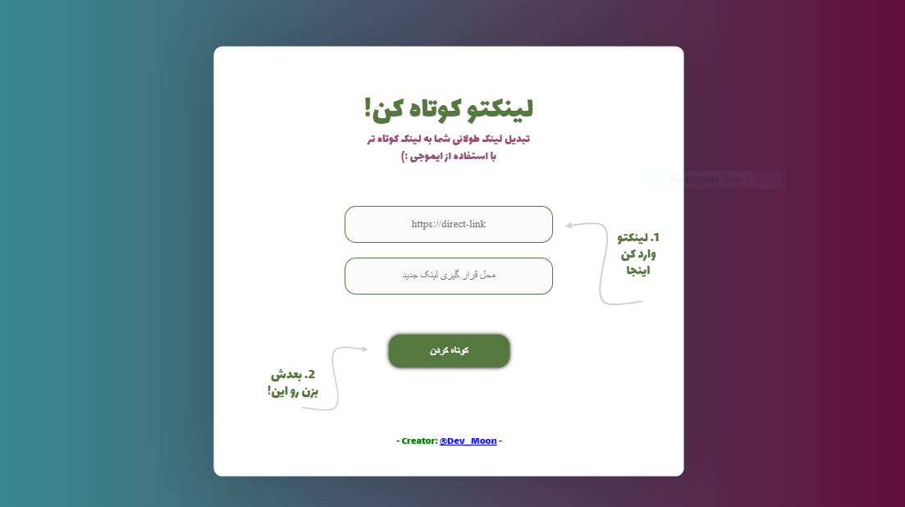

# LinkShortener
🔧 this script make the link's shorter via emoji's. 

# ScreenShot


# Conponents:

```
pip install -r requirements.txt
```


# To start:

```
python main.py
```


# support:
<a href="https://www.coffeete.ir/cumoon"></a>


# ⭐
Please give Star to this repository
